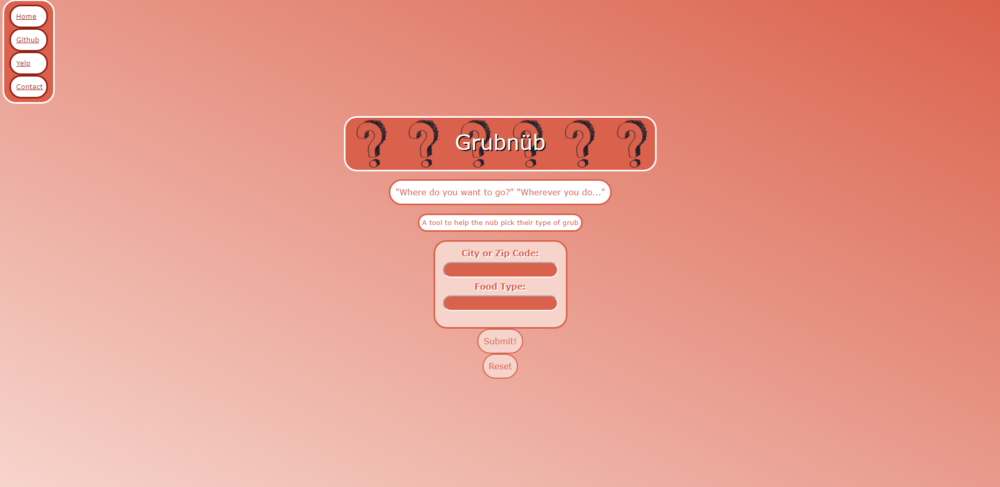

# Group-Project-1 | Grubnüb
## Description
- We aimed to solve the life long issue that plagues friend groups. Have you ever wondered why it is so difficult to eat with your friends due to different wants and needs! Well we decided to remove that problem with a randomizer that cures the illness of indecisiveness. 
- We built this project in order to save the future of friend groups and allow for consistent decision making across food locations. 
- What did you learn? We learned that you can create interactions with other apis and utilize a multitude of information in order to mold it to your liking.  
## Table of Contents
- [Installation](#installation)
- [Usage](#usage)
- [Credits](#credits)
- [License](#license)
- [Features](#features)
## Installation
Create a new repository on your GitHub account and clone it to your computer.

When you're ready to deploy, use the git add, git commit, and git push commands to save and push your code to your GitHub repository.

Navigate to your GitHub repository in the browser and then select the Settings tab on the right side of the page.
## Usage
[Project.io](https://nodgyd.github.io/Group-Project-1/)

## Credits
Github Contributors
[Catalina](https://github.com/Am4z0nas21)
[Rory](https://github.com/rorylivingston)
[Alec](https://github.com/GrrHiGrr)

Server Side Api's Utilized
- Yelp Fusion

Third Party Api's Utilized
- Jquery
- Bootstrap

## License
MIT License

Copyright (c) 2021 nodgyd

Permission is hereby granted, free of charge, to any person obtaining a copy
of this software and associated documentation files (the "Software"), to deal
in the Software without restriction, including without limitation the rights
to use, copy, modify, merge, publish, distribute, sublicense, and/or sell
copies of the Software, and to permit persons to whom the Software is
furnished to do so, subject to the following conditions:

The above copyright notice and this permission notice shall be included in all
copies or substantial portions of the Software.

THE SOFTWARE IS PROVIDED "AS IS", WITHOUT WARRANTY OF ANY KIND, EXPRESS OR
IMPLIED, INCLUDING BUT NOT LIMITED TO THE WARRANTIES OF MERCHANTABILITY,
FITNESS FOR A PARTICULAR PURPOSE AND NONINFRINGEMENT. IN NO EVENT SHALL THE
AUTHORS OR COPYRIGHT HOLDERS BE LIABLE FOR ANY CLAIM, DAMAGES OR OTHER
LIABILITY, WHETHER IN AN ACTION OF CONTRACT, TORT OR OTHERWISE, ARISING FROM,
OUT OF OR IN CONNECTION WITH THE SOFTWARE OR THE USE OR OTHER DEALINGS IN THE
SOFTWARE.

## Features
- User input area that pulls from yelp api based on City or Zip Code.
- User input area that pulls user data based on food type to be than randomized with a math function and the winning word will be pulled from yelp api.
- Local storage feature to store user information incase they left the page.
- Reset button that clears local storage and resets page.
- Nav bar that relocates user to the respect Nav buttons. 
